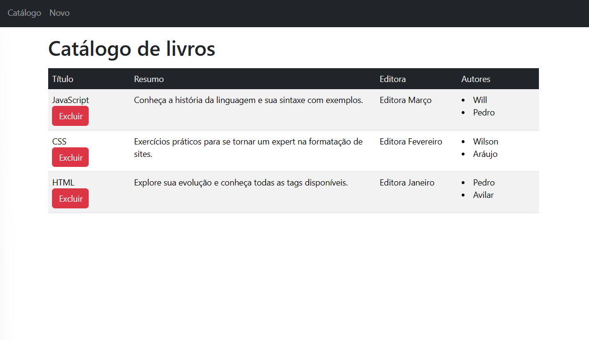
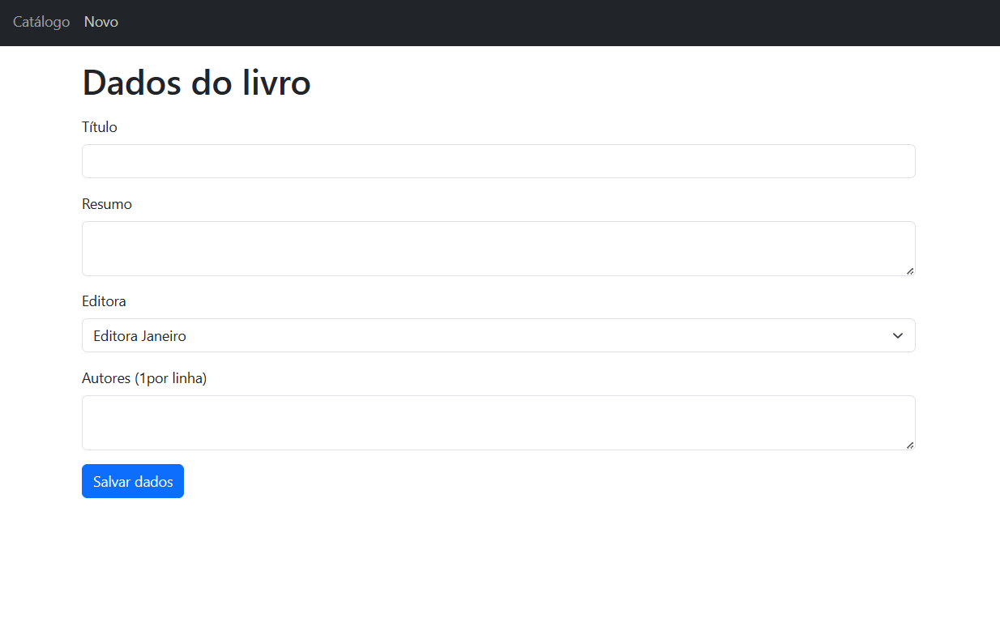
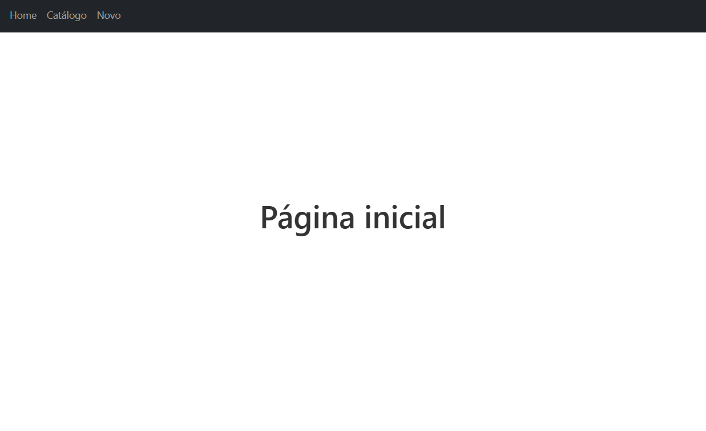
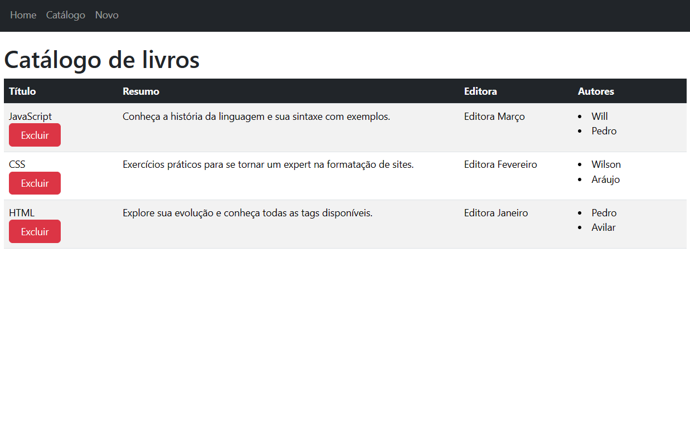
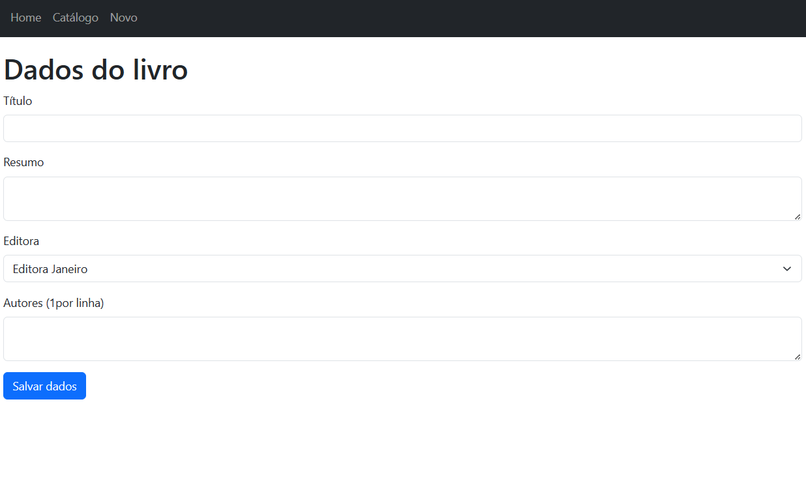

# Faculdade Estácio

## Curso Desenvolvimento Full Stack

## Mundo 2 - Nível 3

## Lucas Alves Vieira da Silva

### Página de listagem e cadastro de livros com React JS

Implementado com HTML, TypeScript e React JS, criando um front-end para Web, baseado em componentes reutilizáveis.

### Página de listagem e cadastro de livros com Next JS

Implementado com HTML, TypeScript e Next JS, criando um front-end para Web, baseado em componentes reutilizáveis. Utilizando o Next JS para a definição de uma API no estilo REST, de uso interno, com acesso via função fetch, oferecida no ambiente padrão do JavaScript.

